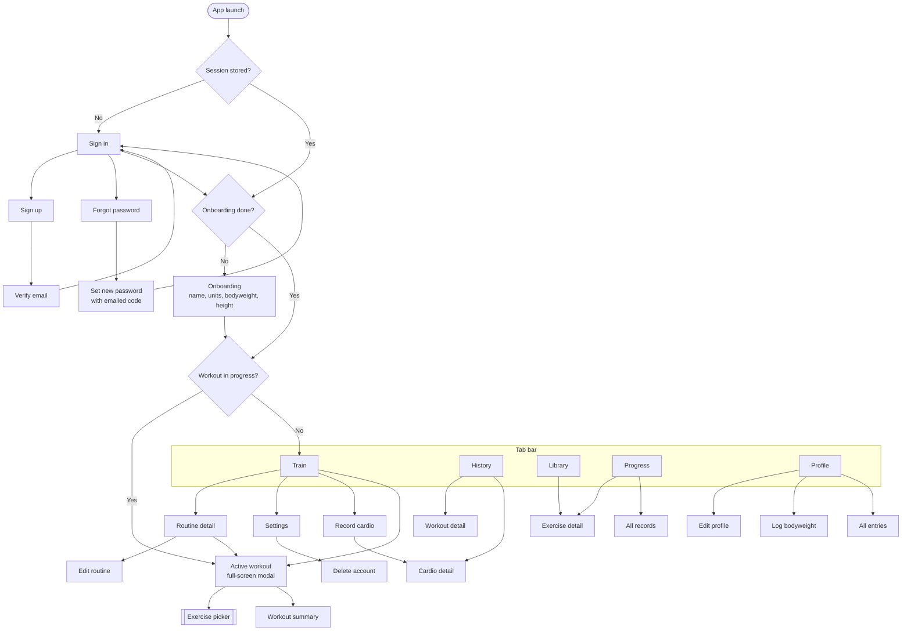

# Navigation flow

Where each screen is reached from. The launch checks decide the first screen. The double-bordered box is a modal screen rather than a pushed one.

```mermaid
flowchart TD
  launch([App launch]) --> gate{Session stored?}
  gate -- No --> signIn[Sign in]
  signIn --> signUp[Sign up]
  signUp --> verify[Verify email]
  verify --> signIn
  signIn --> forgot[Forgot password]
  forgot --> reset[Set new password<br/>with emailed code]
  reset --> signIn
  gate -- Yes --> onboarded{Onboarding done?}
  signIn --> onboarded
  onboarded -- No --> onboarding[Onboarding<br/>name, units, bodyweight, height]
  onboarding --> inProgress
  onboarded -- Yes --> inProgress{Workout in progress?}
  inProgress -- Yes --> workout
  inProgress -- No --> train

  subgraph tabs["Tab bar"]
    train[Train]
    history[History]
    library[Library]
    progress[Progress]
    profile[Profile]
  end

  train --> routine[Routine detail]
  routine --> routineEdit[Edit routine]
  library --> exercise[Exercise detail]
  train --> settings[Settings]
  settings --> deleteAccount[Delete account]
  train --> cardio[Record cardio]
  cardio --> cardioDetail[Cardio detail]
  train --> workout[Active workout<br/>full-screen modal]
  routine --> workout
  workout --> picker[[Exercise picker]]
  workout --> summary[Workout summary]

  history --> workoutDetail[Workout detail]
  history --> cardioDetail

  progress --> exercise
  progress --> records[All records]

  profile --> editProfile[Edit profile]
  profile --> logBodyweight[Log bodyweight]
  profile --> bodyEntries[All entries]
```
